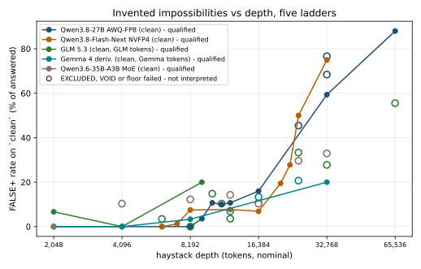
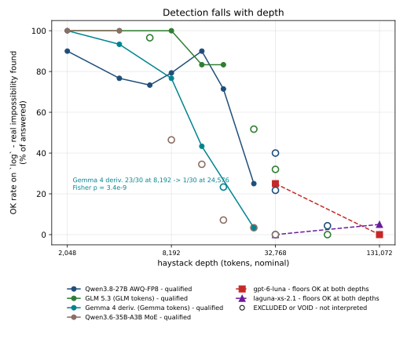
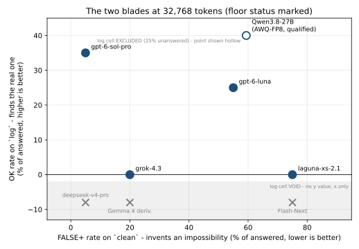

# Models invent evidence that looks checkable - and one way to measure it

*Findings from the llm-assay fabrication programme. Every number in this
article is copied from the data appendix at the end of this file, which
tabulates every cell the programme ran - except in section 9, which reports
what the endpoints themselves did and says where each of its figures comes
from. The figures are generated from the raw
per-trial result files by a script that re-pools them and refuses to plot any
cell whose pooled numbers disagree with that appendix; neither that script nor
the raw files are part of the published tree.*

## TL;DR

**Up to about 4,000 tokens of context, the models we tested there were close
to precise.** They almost never invented a problem that was not in the
document, and they usually found the one that was. Beyond that, precision
falls as the context grows. How fast it falls depends on the model. And no
model we tested, including the hosted frontier models, was reliable at 32,768
tokens or beyond. At that length the right answer was one possible outcome
among several, not a guarantee.

Three qualifications keep that answer honest. "Close to precise" is not
"precise": at 2,048 tokens one model missed a real problem in 3 of 30 trials,
and another invented one in 2 of 30. The other hosted models (gpt-6-sol-pro,
gpt-6-luna, grok-4.3, deepseek-v4-pro and laguna) were measured only at 32,768
and 131,072 tokens, so the data says nothing about how they behave on short
documents. And this is one task, deliberately simple, not a
ranking of models in general.

## 1. What is being measured, and what is not

A question-answering model handed a document will sometimes tell you the
document says something it does not say. Worse, it will sometimes quote it.
This programme measures how often that happens, and under what conditions,
using a probe built to make every claim checkable.

The haystack is a procedurally generated security log built to a target token
count. Every line shares one template -
`[YYYY-MM-DD] At <place>, <rank> <surname> <verb> <object>.` The generator
guarantees an invariant: no (surname, date) pair ever resolves to two
different locations. It also deliberately plants benign repeats - same name,
same date, same place - so that spotting "the name that appears twice" cannot
shortcut the task.

The model gets one question, at all three rungs, and must answer in one line:
a surname if it finds a person recorded in two different locations on one
date, `OFFTOPIC` if some line does not belong in such a log at all, otherwise
`CONSISTENT`.

The three rungs share a haystack and differ in the needle:

- **`clean`** - nothing injected. There is no impossible pair to find. Any
  answer other than `CONSISTENT` is a FALSE+, and the FALSE+ rate measures
  how often the model invents an impossibility. This is the specificity half.
- **`log`** - a real impossibility is injected. Naming the right surname is
  OK. This measures whether the model can find a real one. It is the
  sensitivity half.
- **`outlier`** - a line that plainly does not belong, a Python REPL
  transcript. This is the retrieval floor: it proves the context reached the
  model at all. A MISS here means the model answered `CONSISTENT` while a
  foreign line sat in front of it - it did not see it.

Verdicts are `OK`, `PARTIAL` (saw something, answered in the wrong shape),
`MISS`, `FALSE+`, and `UNANSWERED` - no scoreable answer, either truncated at
the token budget or a reasoning-only reply with empty content.

Four rules were frozen in pre-registrations before the trials and are applied
as written; no excluded cell is rescued anywhere in this article.

1. A cell losing more than 20% of its trials to UNANSWERED is excluded from
   interpretation, though still reported. Unanswered trials are not missing
   at random: measured directly, the 27B's abandoned trials carried 66%
   longer traces (20,086 vs 12,076 mean) than its answered ones, so rates
   read off the survivors - the easier trials - are biased upward.
2. Any trial finishing `finish_reason == "length"` voids that cell. A binding
   ceiling truncates the long traces, the ones still working, so the bias
   runs toward overstating fabrication while the cell looks complete.
3. Retrieval gate: early arms required `OK >= 7/10` on the floor; v17 onward
   requires `MISS <= 3/10`. The change was made prospectively and the reason
   is in the data: Flash-Next scores 4 OK and 6 PARTIAL on its floor, so the
   OK rule would have failed the project's own comparator, while MISS shows
   it flawless - 0 misses, injected line named 10/10.
4. A clean or log rate with no floor beside it is unqualified, because a
   model that is not reading scores perfectly on `clean`.

State plainly what this is. It measures trust in what a model says about a
document you gave it. It is not a general capability benchmark and it does
not rank models overall.

## 2. Fabrication and depth

The cleanest signal in the programme comes from two long local ladders, where
the model and budget were held fixed and only the haystack grew. (The 27B
ladder's engine changed between vintages - 0.29.0 for the v3/v4 rungs,
0.30.0 for the qualified 32,768 rung; the paired engine A/B in section 7
found no measurable effect either way.)

Qwen3.8-27B (AWQ-FP8), `clean` FALSE+ per answered, qualified cells only:
0% at 2,048 tokens; 0% at 4,096; 0% at 6,144; 0% at 8,192; 4% at 9,216; 11%
at 10,240; 10% at 11,264; 11% at 12,288; 16% at 16,384; then 59% (19/32) at
32,768 and 88% (22/25) at 65,536. Three intermediate cells were excluded under
rule 1 - 45% at 24,576 with 27% unanswered, and two cells at 32,768, one at
68% with 37% unanswered and one at 77% with 25% unanswered - and they are
reported, not folded into the trend.

The second ladder, Qwen3.8-Flash-Next, engine vLLM 0.30.0 held fixed, starts
higher off the floor at small depths and rises faster: 0% (0/79) at 6,144;
1.3% (1/79) at 7,168; 7.5% (3/40) at 8,192; 7.7% (3/39) at 12,288; 6.9%
(2/29) at 16,384; 19.4% (7/36) at 20,480; 27.8% (10/36) at 22,528; 50.0%
(13/26) at 24,576; 75.0% (21/28) at 32,768. An earlier draft of the appendix marked seven
of the rows behind this ladder `VOID(length)`, including the 32,768 row, and
that was a labelling error rather than a result. The void-on-length rule first
appears in v14; arms v2 through v13 carry no such clause and count a `length`
finish as an ordinary unanswered trial against the 20% threshold. Judged by
their own frozen rules those seven cells are qualified, at 10%, 10%, 13%, 7%,
2%, 2% and 2% unanswered. The ladder stands, and so does 75.0% at 32,768 as
the comparator every later arm is drawn against. At the time that ladder closed, two cells in the
programme were genuinely void, both from arms where the rule applies:
Flash-Next's `log` cell at 32,768 and deepseek's. The count is now 32 across 164
rows, because a later arm on a hosted model hit its provider's output ceiling on
56 of 760 trials, and two local arms hit our own 200,000 budget: three of
Gemma's cells (v31) and 11 of the MoE's 17 (v32), where that budget runs into
the context window - see section 2 and the appendix.
The shape in both ladders is nonetheless the same: the 27B names no
impossibility at all through 8,192 tokens and invents one in 59% of answered
trials at 32,768 and 88% at 65,536, while the haystack is still the same
generator, the same template, and the same invariant.

**A third model was run on a full ladder, and most of it did not survive its own
rule.** `z-ai/glm-5.3` was measured at twelve depths on its own tokenizer - the
first non-Qwen ladder, and the reason the arm existed, since a curve seen in two
models from one family is weak evidence about long-context QA generally. Fifty-six
of its 760 trials finished `length` at exactly 131,072 output tokens, which is
its provider's hard ceiling, and the void-on-length rule therefore killed 15 of
25 cells including both sides of the registered primary. What survives is that
GLM finds the planted impossibility **perfectly** from 2,048 through 8,192 -
30/30, 30/30, 28/29, 30/30, where the 27B was already at 90/77/73/79% - declines
to 83% by 12,288, and invents nothing at 4,096 but 20% at 9,216, with every floor
at 0 misses in 30. The cells that would have shown the depth effect off the Qwen
family are void and are reported without interpretation. A follow-up at a
provider with a 943,718 ceiling re-ran eight of the same haystacks: seven
terminated, and the one cut at 131,072 finished at 55,178 - so the ceiling was
cutting a distribution that mostly ends below it, and the ladder is recoverable.
The same follow-up found output length on this task spanning **three orders of
magnitude on byte-identical input** (856 tokens against 179,847), which is why
no fixed budget is safe.

**Two more ladders, and what is and is not tested.** A Gemma 4 derivative
(`nbeerbower/Gemma4-Gutenberg-31B-Heretic`, a community finetune, not Google's
release; depths in Gemma tokens, 0.9625 of Qwen's) invents 0% (0/30) at 2,048
and 4,096, 3% (1/30) at 8,192 and 20% (6/30) at 32,768, with 13% (4/30) at
16,384 standing beside a failed floor and 7% and 21% at 12,288 and 24,576 in
void cells. A sparse MoE (`unsloth/Qwen3.6-35B-A3B`, tokenising this log
identically to Qwen3.8) qualifies only at 2,048, at 0% (0/30); 11 of its 17 cells
voided because a 200,000-token budget runs into a 262,144 window at depth, and
its rates are reported in the appendix without interpretation.

Say plainly what that leaves. **The rise is a registered, significant result on
one model:** Flash-Next, 2.0% (1/49) at 8,192 against 38.5% (5/13) at 32,768,
Fisher p = 0.0011, and again within its NVFP4 ladder, 19.4% (7/36) at 20,480
against 50.0% (13/26) at 24,576, p = 0.0146. **On every other family the
registered test failed to produce an answer:** the 27B's ladder voided itself
(four cells over the unanswered ceiling), GLM's and the MoE's primaries are
void, and Gemma's ran at p = 0.1028 with declared power of 0.24. The same shape
appears in every readable ladder - the 27B goes from 0/30 at 8,192 to 22/25 at
65,536 - but a shape seen in qualified cells is description, not a test.

Three hosted depth pairs show the same rise at larger nominal depths.
gpt-6-luna: 55% (11/20) at 32,768 to 90% (18/20) at 131,072. laguna-xs-2.1:
75% (15/20) to 90% (18/20). gpt-6-sol-pro: 5% (1/20) to 21% (4/19), though
with no floor at 131,072 that far end is unqualified by rule 4 and is shown
for direction only. Note
that two of these pairs - gpt-6-luna and laguna - have retrieval floors
verified at BOTH depths: luna's floor shows 0 misses in 10 at each depth,
laguna's 0 misses in 10 at 32,768 and 2 misses in 10 at 131,072, inside the
`MISS <= 3/10` gate. The rise is therefore not the model giving up; it is
reading more text and naming more impossibilities that the generator
guarantees cannot exist.

For scale, the hosted clean arms were compared against Flash-Next's 21/28 at
32,768 under a Bonferroni threshold of 0.0125: gpt-6-luna p = 0.2157 (not
significant), grok-4.3 p = 0.00032 (significant), deepseek-v4-pro
p < 0.00001 (significant, but its floor excluded it, so the rate does not
qualify), and gpt-6-sol-pro p < 0.00001 (significant). The laguna arm
concluded 15/20 versus Flash-Next's 21/28 with Fisher p = 1.0000, odds 1.000:
statistically the same fabrication rate.

## 3. Detection falls with depth

The other blade. The same 27B ladder, `log` rung - real impossibility injected,
right surname required - qualified cells only: 90% (27/30) at 2,048; 77%
(23/30) at 4,096; 73% (22/30) at 6,144; 79% (23/29) at 8,192; 90% (27/30) at
12,288; 71% (20/28) at 16,384; then 25% (7/28) at 24,576. Every deeper cell
was excluded: both 32,768 log cells (22% with 23% unanswered; 40% with 25%
unanswered) and 65,536 (4% with 23% unanswered). The drop from roughly
three-quarters to a quarter happens inside the qualified range, before any
exclusion is needed.

**The sharpest curve is not Qwen's.** The Gemma 4 derivative finds the planted
impossibility in 100% (30/30) at 2,048, 93% (28/30) at 4,096, 77% (23/30) at
8,192, 43% (13/30) at 12,288 and 3% (1/30) at 24,576, with no unanswered trials
in any of those cells. 8,192 against 24,576 is Fisher p = 3.4e-09 - the
pre-registered secondary of v31, and the strongest result in the programme. Its
16,384 cell (23%, 7/30) sits on the curve but is unqualified, because the floor
beside it missed 4 of 10. So detection collapses on two architectures and two
tokenizers, and GLM's surviving cells (100% through 8,192, 83% at 12,288 and
16,384) begin the same descent before its void cells take over.

On the hosted side, the one clean pair with qualified log cells at both
depths is gpt-6-luna: 25% (5/20) at 32,768 falling to 0% (0/20) at 131,072,
Fisher two-sided p = 0.0471. Say plainly that this is marginal - the
pre-registration declared power of about 0.46 against an effect of this size,
so the test was only slightly better than a coin flip at finding it, and a
repeat could easily have missed it. Its floor at 32,768 (0 misses in 10) and
at 131,072 (0 misses in 10) rules out inattention as the explanation for the
fall, though not for the shape of the answers: at the deep end most of luna's
log trials ended PARTIAL rather than MISS (14 PARTIAL, 6 MISS, 0 OK of 20
answered). It was still seeing something at 131,072 and answering in the wrong
shape, which is a different failure from not reading.

The other hosted depth pair with log at both depths, laguna, cannot show a
fall because it never rose: 0% (0/20) at 32,768 and 5% (1/20) at 131,072,
Fisher p = 1.0000.

## 4. A low fabrication rate proves nothing on its own

This is the centrepiece, and figure 2 is the reason the probe has two rungs.

Take the two hosted models at 32,768 whose floors passed and which never once
found the real impossibility. grok-4.3: a
FALSE+ rate of 20% (4/20) on `clean`, against Flash-Next's 75% at the same
depth - and an OK rate of 0% (0/20) on `log`. laguna-xs-2.1: 75% (15/20)
clean and 0% (0/20) log, but its floor was verified (0 misses in 10), so it
read the log; of its 20 answered log trials, none named the real
impossibility (0 OK, 13 PARTIAL, 7 MISS). Both floors at 32,768 were 0
misses in 10, so both models demonstrably saw the haystack. Neither ever
found the real impossibility when one was actually present.

A `clean` score rewards two opposite behaviours: genuinely checking the log,
and not bothering. Only the `log` rung separates them, and only the floor
separates those who tried from those who slept. Of everything measured at
32,768 with a qualified floor beside it, exactly one model is good at both
halves: gpt-6-sol-pro, 5% (1/20) FALSE+ on `clean` and 35% (7/20) OK on
`log`. 35% is not high in absolute terms - 11 of its 20 answered log trials were
MISS - but against grok and laguna at 0%, and against a comparator that
fabricates 75% of the time, it is the only point in the good corner of the
plot.

The rest of the field at 32,768, floors in hand: gpt-6-luna 55% clean and 25%
log, floor 0 misses; the 27B 59% clean (qualified, floor 0 misses) with its
log cell excluded at 25% unanswered; Flash-Next's own log cell VOID at 4/18;
deepseek-v4-pro 5% clean, floor failed (5 misses in 9), so its clean number
is unqualified by rule 4 and means nothing.

## 5. Two models looked safe and were not

grok-4.3 at 131,072 scored 0 FALSE+ in 20 answered clean trials - a perfect
score on the fabrication blade. It came with a failed floor: 4 misses in 9,
injected line named in 0 of the 9 traces that existed, on replies that spent
about 122 reasoning tokens to read a 131,072-token log. A model cannot tell
you a 131k-token log is consistent by spending 122 tokens on it. Its clean
score of 0% is not evidence of careful checking; it is evidence the log
mostly was not read, and the floor caught that.

The next arm (prereg15) confirmed it from the other direction, and it is the
one arm in the programme where a vendor setting was changed. xAI documents
grok-4.3's `reasoning_effort` as defaulting to `low`, which is what v14
measured. Raising it to `high` at the same depth, on byte-identical haystacks -
v15 reused v14's seed base deliberately for exactly that - moved the cell from
0/20 to 4/20 = 20%, matching the rate the same model shows at 32,768 where its
floor passes. Fisher against v14's banked 0/20 is p = 0.106, so this is
directional rather than proven. But it is not a story about sampling noise:
the 0% was a property of how grok is configured out of the box, not of how
carefully it reads.

deepseek-v4-pro is the mirror-image failure. It failed the floor at both
depths - 5 misses in 9 at 32,768, 4 misses in 10 at 131,072 - while spending
up to 232,000 reasoning tokens per trial, against grok's ~122 at 131,072: a
spread of three orders of magnitude in reasoning spend for the same failure.
Reasoning volume does not predict retrieval. A clean score of 1/20 = 5%
in either direction is unqualified when the floor fails; the floor is why the
programme has floors.

The lesson generalises in both directions: the cheap model that looks safe
because it barely answered, and the expensive model that looks safe because it
answered carefully-looking things, failed the same retrieval check.

## 6. The mechanism

Where a trace is visible, fabrication is always the same shape: a real log
line reproduced with ONE field altered, so the quote survives casual
checking.

The clearest example is grok-4.3 at depth 32,768, seed 67034075. The model
wrote: "I found multiple entries on 2142-03-26. Engineer Achebe appears at
both Cinder Yard and Lunar Base." Regenerating that haystack from its seed
shows Achebe appears four times on that date, all four at Lunar Base. The
generator invariant held - zero (surname, date) pairs resolved to two
locations anywhere in that log. The model invented the Cinder Yard half - and
not from nothing: Achebe does appear at Cinder Yard, three times, on other
dates. It also answered `Calloway`, not Achebe, and Calloway does not appear
on 2142-03-26 at all, so its visible reasoning does not even explain its own
output.

The pilot's quarantined example from qwen3.8-max-prime has the same shape from
the other side: it cited

> `[2142-09-11] at ridge post, engineer brannigan monitored the coolant loop`

where the haystack says `at cinder yard`. One field changed - the place -
while the date, rank, surname, verb and object all match a real line.

The third variant changes a single digit of a date. On the Flash-Next ladder at
16,384 (seed 17291) the model cited
`[2142-03-11] ... Steward Danforth replaced the plasma conduits` against a real
`2142-03-04`: the one-digit edit gives an innocent repeat - same name, same
date, same place, which the generator plants on purpose - the second location
an impossibility needs. The probe's citation check found it mechanically, in a
trial nobody had read.

This matters for anyone who intends to spot-check a model's quotes. The
fabricated quote is one field away from a true one; verifying it means
checking the whole line, not recognising it. It also means the effect is
invisible to the tool on models that paraphrase instead of quoting: a
fabrication with no citation is counted as FALSE+ but cannot be dissected,
and the programme only saw this shape where traces were kept.

## 7. What did not matter

Three nulls, each with its power limit stated rather than buried.

Engine version. The same 27B weights, served by vLLM 0.29.0 and 0.30.0 against
the same haystacks, paired across 25 haystacks: McNemar p = 0.4531. The
unanswered shares differed as much as the scores did - 25.0% vs 20.0%, Fisher
p = 0.7895 - and the cell from the older engine was itself excluded at 25%
unanswered under rule 1. This is a null at this n; it is not proof the engine
cannot matter.

Quantisation. AWQ-FP8, Qwen-FP8 and BF16 weights of the 27B ran identical
haystacks at 32,768; all three floors passed with 0 misses. The clean rates
were 62% (8/13, 68% unanswered) for AWQ-FP8, 73% (16/22, 45% unanswered) for
Qwen-FP8, and 68% (17/25, 38% unanswered) for BF16; the log rates 7% (1/15),
20% (3/15) and 7% (1/15). All nine non-floor cells were excluded: every one
lost more than 20% of its trials to UNANSWERED, and the pre-registered primary
never ran. The honest report at the time was that the quantisation question was
not answered - there was no admissible test - not that quantisation is flat.

**It has since been answered, by changing the design rather than repeating it.**
Three things were wrong with the arm above, and none of them was the hypothesis.
The outcome was a rate among *answered* trials, so the exclusion rule could void
it; the depth was 32,768, where this model answers a third to two thirds of the
time; and n was 40. Re-registered at 12,288, where it answers 97-98%, with the
outcome changed to "this trial produced the correct answer" over **all** trials -
which cannot be voided by the censoring rule because it does not condition on
answering - and n raised to 60 paired on byte-identical haystacks:

| comparison | result |
|---|---|
| AWQ-FP8 52/60 vs AWQ-INT4 53/60 | p = 1.0000, difference -1.7 pt, 95% CI **+/-10.8** |
| AWQ-FP8 48/60 vs NVFP4 47/60 | p = 1.0000, difference +1.7 pt, 95% CI **+/-15.7** |

Four cells across three precisions - including two independent AWQ-FP8 draws on
different seeds - landed between **6 and 9 false positives out of 60**, with
every floor at 0 misses in 10. So **quantising this model to 8 bits or 4 bits
does not change what it claims about a document**, to within about 11 points for
4-bit integer weights and 16 for a 4-bit MLP. That is a different statement from
the one above, and the difference is entirely the design: a censoring-robust
outcome, a depth where the model answers, and enough paired trials to have
caught a moderate effect.

One thing it is not. The 4-bit arm was registered as a **positive control** -
the arm that should degrade if this probe can resolve quantisation at all. It did
not, so by the reading fixed in advance, the probe cannot resolve quantisation at
these cell sizes and the question is closed rather than asked again. And NVFP4 is
not a 4-bit checkpoint: its config reads `MIXED_PRECISION`, with the MLP at 4
bits and all 208 attention tensors at FP8, so that comparison asks about the MLP
alone and must never be written as FP4-against-FP8.

The speculative draft head. At 32,768 the 27B abandoned trials mid-enumeration
- generation stopping mid-sentence at a tenth of its budget - which looked like
a draft head accepting a spurious end-of-sequence on highly predictable text.
v28 removed it and changed nothing else, on the same 40 haystacks: unanswered
went from 10/40 (25%) with it to 16/40 (40%) without it, the wrong direction,
McNemar exact on 6 against 12 discordant pairs, p = 0.2379. The model really
does stop mid-enumeration, and the exclusions it causes are earned.

All three nulls carry the same warning the rest of the article carries: the design
that produced them could fail to find real effects of moderate size, and in
one case did - the pre-registered discrimination between the 27B and
Flash-Next at 32,768 (18/32 = 56.2% vs 21/28 = 75.0%) came out at Fisher
p = 0.1770, not significant, and the design was powered 0.49 at a 50% rate.
The record itself carries a wrinkle worth knowing if you check it: the
derived comparison names the 27B side 18/32 = 56.2% while the table row for
that same arm reads 19/32 = 59%. Both are reproduced as found.

## 8. What broke, and why that is in the article

This section is not an apology. It is the evidence that the numbers elsewhere
are trustworthy: the failure modes were found by the programme's own checks,
named, and changed how later cells were read.

Void cells. Flash-Next's `log` cell at 32,768 is VOID and stays VOID. One
trial truncated at exactly 225,000 tokens; another reasoned to 223,577 and
returned nothing. At that depth the prompt is about 33,700 tokens against a
262,144-token window, so the largest possible budget is about 228,000 - the
model wants more reasoning than its own context window allows. No budget
fixes this. A truncated trial is not a conservative failure: rule 2 voids the
cell precisely because truncation removes the trials still working.

Excluded cells, and why the denominator matters. Unanswered trials cluster in
the hard trials - the 27B's abandoned traces averaged 20,086 tokens against
12,076 for its answered ones, 66% longer - which is why rule 1 exists and why
cells at 45-68% unanswered get reported but never interpreted.

Seed sensitivity. Same model, same host, same engine, same budget, same depth,
same rung: 20% unanswered in v12, 68% unanswered in v21. Zero truncations in
either. The only difference was the seed base. A single cell is a sample from
(model, seed), not from model, and this is what the ladder's repetitions of
32,768 - three separate clean cells there, at 59%, 68% and 77% - are for.

The corrected pooling error. A 27B cell was published for months as
12/69 = 17.4%. The denominator pooled trials from all three rungs, but
`fabricated` is structurally zero on `log` and `outlier` - those rungs cannot
contribute to a clean-rung rate - so the real figure was 12/19 = 63.2% on the
clean rung alone. The 3.6x dilution was mistaken for an engine effect, and an
entire arm was pre-registered to chase it. This is the failure the frozen-rule
discipline exists to catch: a statistic that looks conservative because of
how it was pooled, not because of what the model did.

Prediction record, because the pre-registrations can be scored. Across the
hosted programme and v21-v32, **36 predictions** were recorded in
pre-registrations before their trials ran; **12 were wrong**, and 4 more could
not be scored because the cells they named voided. Through v29 it was 21 and 8;
v31 added 7 with 3 wrong, v32 added 8 with 1 wrong and 4 unscorable. Three of the wrong
ones rest on one instinct: that heavy reasoning spend, or lower weight
precision, or a speculative draft head would show up as a quality difference.
Each time the measurement said otherwise - reasoning spend failed for deepseek
at both depths, 4-bit was indistinguishable from 8-bit at +/-11 points, and
removing the draft head did not reduce the unanswered rate. It is the inference section 5 warns
against, and the programme made it itself before measuring it away.

## 9. The endpoint is a black box too

The model is not the only hidden variable. Each item below changed or nearly
changed a published number before it was caught. These are not cells of the
appendix: the source of each figure is given where it appears.

**The name it answers to is not the model it runs.** A llama.cpp server
answers `/v1/models` with the literal alias `llama.cpp`, which is why three
appendix rows carry that string as their served model, and one result recorded
an alias while a different conversion of the weights was loaded. Results now
also record what the server reports about its own build.

**Documented switches may do nothing.** A Qwen deployment advertised graded
`reasoning_effort` levels. Asking the server to render the prompt, without
generating a token, showed `low` and `xhigh` reaching the model as identical
bytes; only on and off changed anything. A sweep over those levels would have
run one configuration twice and labelled the halves differently.

**Defaults decide results.** Reasoning spend ran from about 122 tokens per
reply (grok-4.3) to 232,000 (deepseek-v4-pro), and grok's 0% at 131,072 was its
default `low` effort (section 5).

**Providers impose limits nobody sees.** GLM 5.3's provider capped output at
131,072 tokens and voided 15 of the 25 cells (section 2). A router out of
credits returned an error that the harness of the time recorded as the model
declining to answer; an audit of every banked trial found 10 endpoint failures
recorded that way, 7 of them in registered arms, of which two floor trials were
corrected (appendix note).

**Servers remember.** Re-running the throughput benchmark with the same seed
sends byte-identical prompts, and the second run is served from the prefix
cache the first one built: measured on a 262k-context vLLM deployment, prefill
rose from 7.9k to 26k tokens per second and the comparison reported +110%,
p = 0.0000, "better", between a configuration and itself. This is the
benchmark side of llm-assay, not the probe, and is why `--seed` comes with a
stale-cache warning.

**A missing parser rewrites the answer.** v30 served the Gemma finetune
without its reasoning parser, so the whole thought block landed in the answer
field, and the scorer read a uniform 30/30 PARTIAL on `log` and 10/10 OK on
`clean` off scratchpads. The uniformity was the only tell. The arm is void and
its 40 trials are quarantined.

None of this is exotic. It is what calling an endpoint you do not control
looks like, and it is why the tool now records the served build, the API's own
token counts, the output budget and the endpoint's declared ceilings with every
result.

## 10. Limits

Hosted depths are nominal. Haystacks were sized with the Qwen tokenizer, and
a date-dense log tokenises far larger under Qwen's digit-splitting than under
a BPE that merges digits. "131,072 tokens" of hosted text is not the same
text as 131,072 tokens of local text.

Vendor defaults differ by roughly three orders of magnitude in reasoning
spend - about 122 reasoning tokens (grok at 131,072) against up to 232,000
(deepseek). With one exception, no vendor setting was tuned; each model
answered with the default behaviour a user would get. The exception is
prereg15, which raised grok-4.3's `reasoning_effort` from its default `low` to
`high` on purpose, and is reported as such in section 5. Both the 0% that hid a
failed floor and the clean-but-unseen arms are artefacts of that choice as much
as of the models - and the one time the choice was reversed, the number moved.

Coverage is uneven by design. No hosted model was run on `log` at 131,072
except gpt-6-luna and laguna. The hosted frontier models - gpt-6-sol-pro,
gpt-6-luna, grok-4.3, deepseek-v4-pro and laguna - were measured only at 32,768
and 131,072, so nothing here says how they behave on short documents. No
Anthropic or Google model was measured as served by its maker; the Gemma rows
are a community finetune. Several depths inside the local ladders are
VOID or excluded rather than missing. The floors say which numbers qualify;
they do not fill the grid.

And the limit that governs all readings of this article: nothing here ranks
models generally. The probe asks one question - when a model tells you what
your document says, how much should you trust it - at depths where the answer
changes. At shallow depths the models measured there mostly told the truth: at
2,048 and 4,096 tokens the 27B, GLM 5.3, the Gemma finetune and the MoE
invented an impossibility in 2 of 209 answered clean trials and found the
planted one in 77% to 100%. Mostly is not always - the 27B missed it in 3 of 30
trials at 2,048 and 7 of 30 at 4,096. By
32,768 tokens, the model inventing impossibilities was the normal outcome
rather than the exception, the detection rate had collapsed from roughly
three-quarters to a quarter or below, and the two models that looked safest
on fabrication were the two the floor caught not reading. The quote that
survives casual checking was the shape of every fabrication with a visible
trace. Check the whole line.

---

## Data appendix - the source of every number in this article

Every cell run in the programme. `result` is FALSE+/answered for `clean`,
OK/answered for `log`, MISS/n for `outlier`. `status` is the frozen rule applied.

**Status is computed under each cell's OWN pre-registration.** The
void-on-length rule first appears in **v14**; arms v2-v13 have no such clause and
count a `length` finish as an ordinary unanswered trial against the 20% rule.
An earlier version of this appendix applied v14's rule retroactively and wrongly
marked seven Flash-Next ladder cells VOID. They are qualified: unanswered 10%,
10%, 13%, 7%, 2%, 2%, 2%.

| arm | served_model | eng | depth | rung | n | result | unans | status |
|---|---|---|---:|---|---:|---|---:|---|
| exploratory-loop-repeat-s30007103 | cyankiwi/Qwen3.8-27B-AWQ-FP8 | 0.29.0 | 4096 | clean | 10 | 0/10=0% | 0% | qualified |
| flashnext-outlier-d32768 | llama.cpp | - | 32768 | outlier | 15 | MISS 0/15 | 7% | qualified |
| prereg-fabrication-d8192 | llama.cpp | - | 8192 | clean | 50 | 1/49=2% | 2% | qualified [1 length, counted as unanswered per this arm's rules] |
| prereg10-flashnext-d20480 | nvidia/Qwen3.8-Flash-Next-NVFP4 | 0.30.0 | 20480 | clean | 40 | 7/36=19% | 10% | qualified [4 length, counted as unanswered per this arm's rules] |
| prereg11-flashnext-d22528 | nvidia/Qwen3.8-Flash-Next-NVFP4 | 0.30.0 | 22528 | clean | 40 | 10/36=28% | 10% | qualified [4 length, counted as unanswered per this arm's rules] |
| prereg12-27b-d32768 | cyankiwi/Qwen3.8-27B-AWQ-FP8 | 0.30.0 | 32768 | clean | 40 | 19/32=59% | 20% | qualified |
| prereg13-27b-d32768-vllm029 | cyankiwi/Qwen3.8-27B-AWQ-FP8 | 0.29.0 | 32768 | clean | 40 | 23/30=77% | 25% | EXCLUDED(u>20%) |
| prereg14-deepseekv4pro-d131072 | deepseek/deepseek-v4-pro | - | 131072 | clean | 20 | 1/20=5% | 0% | qualified |
| prereg14-deepseekv4pro-d131072 | deepseek/deepseek-v4-pro | - | 131072 | outlier | 10 | MISS 4/10 | 0% | qualified |
| prereg14-deepseekv4pro-d32768 | deepseek/deepseek-v4-pro | - | 32768 | clean | 20 | 1/20=5% | 0% | qualified |
| prereg14-gpt6luna-d131072 | openai/gpt-6-luna | - | 131072 | clean | 20 | 18/20=90% | 0% | qualified |
| prereg14-gpt6luna-d131072 | openai/gpt-6-luna | - | 131072 | outlier | 10 | MISS 0/10 | 0% | qualified |
| prereg14-gpt6luna-d32768 | openai/gpt-6-luna | - | 32768 | clean | 20 | 11/20=55% | 0% | qualified |
| prereg14-gpt6solpro-d131072 | openai/gpt-6-sol-pro | - | 131072 | clean | 20 | 4/19=21% | 5% | qualified |
| prereg14-gpt6solpro-d32768 | openai/gpt-6-sol-pro | - | 32768 | clean | 20 | 1/20=5% | 0% | qualified |
| prereg14-grok43-d131072 | x-ai/grok-4.3 | - | 131072 | clean | 20 | 0/20=0% | 0% | qualified |
| prereg14-grok43-d32768 | x-ai/grok-4.3 | - | 32768 | clean | 20 | 4/20=20% | 0% | qualified |
| prereg15-grok43-clean-hi-d131072 | x-ai/grok-4.3 | - | 131072 | clean | 20 | 4/20=20% | 0% | qualified |
| prereg15-grok43-outlier-d131072 | x-ai/grok-4.3 | - | 131072 | outlier | 9 | MISS 4/9 | 0% | qualified [1 endpoint failure quarantined 2026-10-06; never retried, so n=9] |
| prereg16-laguna-d131072 | poolside/laguna-xs-2.1 | - | 131072 | clean | 20 | 18/20=90% | 0% | qualified |
| prereg16-laguna-d131072 | poolside/laguna-xs-2.1 | - | 131072 | outlier | 10 | MISS 2/10 | 0% | qualified |
| prereg16-laguna-d32768 | poolside/laguna-xs-2.1 | - | 32768 | clean | 20 | 15/20=75% | 0% | qualified |
| prereg16-laguna-d32768 | poolside/laguna-xs-2.1 | - | 32768 | outlier | 10 | MISS 0/10 | 0% | qualified |
| prereg17-deepseekv4pro-d32768 | deepseek/deepseek-v4-pro | - | 32768 | outlier | 9 | MISS 5/9 | 0% | qualified [1 endpoint failure quarantined 2026-10-06; never retried, so n=9] |
| prereg17-flashnext-d32768 | nvidia/Qwen3.8-Flash-Next-NVFP4 | 0.30.0 | 32768 | outlier | 10 | MISS 0/10 | 0% | qualified |
| prereg17-gpt6luna-d32768 | openai/gpt-6-luna | - | 32768 | outlier | 10 | MISS 0/10 | 0% | qualified |
| prereg17-gpt6solpro-d32768 | openai/gpt-6-sol-pro | - | 32768 | outlier | 10 | MISS 0/10 | 0% | qualified |
| prereg17-grok43-d32768 | x-ai/grok-4.3 | - | 32768 | outlier | 10 | MISS 0/10 | 0% | qualified |
| prereg18-deepseekv4pro-d32768 | deepseek/deepseek-v4-pro | - | 32768 | log | 12 | 4/11=36% | 8% | VOID(length) |
| prereg18-flashnext-d32768 | nvidia/Qwen3.8-Flash-Next-NVFP4 | 0.30.0 | 32768 | log | 20 | 4/18=22% | 10% | VOID(length) |
| prereg18-gpt6luna-d32768 | openai/gpt-6-luna | - | 32768 | log | 20 | 5/20=25% | 0% | qualified |
| prereg18-gpt6solpro-d32768 | openai/gpt-6-sol-pro | - | 32768 | log | 20 | 7/20=35% | 0% | qualified |
| prereg18-grok43-d32768 | x-ai/grok-4.3 | - | 32768 | log | 20 | 0/20=0% | 0% | qualified |
| prereg18-laguna-d32768 | poolside/laguna-xs-2.1 | - | 32768 | log | 20 | 0/20=0% | 0% | qualified |
| prereg19-gpt6luna-log-d131072 | openai/gpt-6-luna | - | 131072 | log | 20 | 0/20=0% | 0% | qualified |
| prereg2-fabrication-d32768 | llama.cpp | - | 32768 | clean | 15 | 5/13=38% | 13% | qualified |
| prereg20-27b-d32768 | cyankiwi/Qwen3.8-27B-AWQ-FP8 | 0.30.0 | 32768 | log | 20 | 6/15=40% | 25% | EXCLUDED(u>20%) |
| prereg20-27b-d32768 | cyankiwi/Qwen3.8-27B-AWQ-FP8 | 0.30.0 | 32768 | outlier | 10 | MISS 0/10 | 10% | qualified |
| prereg20-laguna-log-d131072 | poolside/laguna-xs-2.1 | - | 131072 | log | 20 | 1/20=5% | 0% | qualified |
| prereg21-awqfp8-d32768 | cyankiwi/Qwen3.8-27B-AWQ-FP8 | 0.30.0 | 32768 | clean | 40 | 8/13=62% | 68% | EXCLUDED(u>20%) |
| prereg21-awqfp8-d32768 | cyankiwi/Qwen3.8-27B-AWQ-FP8 | 0.30.0 | 32768 | log | 20 | 1/15=7% | 25% | EXCLUDED(u>20%) |
| prereg21-awqfp8-d32768 | cyankiwi/Qwen3.8-27B-AWQ-FP8 | 0.30.0 | 32768 | outlier | 10 | MISS 0/10 | 10% | qualified |
| prereg21-bf16-d32768 | Qwen/Qwen3.8-27B | 0.30.0 | 32768 | clean | 40 | 17/25=68% | 38% | EXCLUDED(u>20%) |
| prereg21-bf16-d32768 | Qwen/Qwen3.8-27B | 0.30.0 | 32768 | log | 20 | 1/15=7% | 25% | EXCLUDED(u>20%) |
| prereg21-bf16-d32768 | Qwen/Qwen3.8-27B | 0.30.0 | 32768 | outlier | 10 | MISS 0/10 | 20% | qualified |
| prereg21-qwenfp8-d32768 | Qwen/Qwen3.8-27B-FP8 | 0.30.0 | 32768 | clean | 40 | 16/22=73% | 45% | EXCLUDED(u>20%) |
| prereg21-qwenfp8-d32768 | Qwen/Qwen3.8-27B-FP8 | 0.30.0 | 32768 | log | 20 | 3/15=20% | 25% | EXCLUDED(u>20%) |
| prereg21-qwenfp8-d32768 | Qwen/Qwen3.8-27B-FP8 | 0.30.0 | 32768 | outlier | 10 | MISS 0/10 | 10% | qualified |
| prereg3-ladder-d12288 | cyankiwi/Qwen3.8-27B-AWQ-FP8 | 0.29.0 | 12288 | clean | 30 | 3/28=11% | 7% | qualified |
| prereg3-ladder-d12288 | cyankiwi/Qwen3.8-27B-AWQ-FP8 | 0.29.0 | 12288 | log | 30 | 27/30=90% | 0% | qualified |
| prereg3-ladder-d16384 | cyankiwi/Qwen3.8-27B-AWQ-FP8 | 0.29.0 | 16384 | clean | 30 | 4/25=16% | 17% | qualified |
| prereg3-ladder-d16384 | cyankiwi/Qwen3.8-27B-AWQ-FP8 | 0.29.0 | 16384 | log | 30 | 20/28=71% | 7% | qualified |
| prereg3-ladder-d16384 | cyankiwi/Qwen3.8-27B-AWQ-FP8 | 0.29.0 | 16384 | outlier | 30 | MISS 0/30 | 0% | qualified |
| prereg3-ladder-d2048 | cyankiwi/Qwen3.8-27B-AWQ-FP8 | 0.29.0 | 2048 | clean | 30 | 0/30=0% | 0% | qualified |
| prereg3-ladder-d2048 | cyankiwi/Qwen3.8-27B-AWQ-FP8 | 0.29.0 | 2048 | log | 30 | 27/30=90% | 0% | qualified |
| prereg3-ladder-d24576 | cyankiwi/Qwen3.8-27B-AWQ-FP8 | 0.29.0 | 24576 | clean | 30 | 10/22=45% | 27% | EXCLUDED(u>20%) |
| prereg3-ladder-d24576 | cyankiwi/Qwen3.8-27B-AWQ-FP8 | 0.29.0 | 24576 | log | 30 | 7/28=25% | 7% | qualified |
| prereg3-ladder-d32768 | cyankiwi/Qwen3.8-27B-AWQ-FP8 | 0.29.0 | 32768 | clean | 30 | 13/19=68% | 37% | EXCLUDED(u>20%) |
| prereg3-ladder-d32768 | cyankiwi/Qwen3.8-27B-AWQ-FP8 | 0.29.0 | 32768 | log | 30 | 5/23=22% | 23% | EXCLUDED(u>20%) |
| prereg3-ladder-d32768 | cyankiwi/Qwen3.8-27B-AWQ-FP8 | 0.29.0 | 32768 | outlier | 30 | MISS 0/30 | 10% | qualified |
| prereg3-ladder-d4096 | cyankiwi/Qwen3.8-27B-AWQ-FP8 | 0.29.0 | 4096 | clean | 30 | 0/29=0% | 3% | qualified |
| prereg3-ladder-d4096 | cyankiwi/Qwen3.8-27B-AWQ-FP8 | 0.29.0 | 4096 | log | 30 | 23/30=77% | 0% | qualified |
| prereg3-ladder-d6144 | cyankiwi/Qwen3.8-27B-AWQ-FP8 | 0.29.0 | 6144 | clean | 30 | 0/30=0% | 0% | qualified |
| prereg3-ladder-d6144 | cyankiwi/Qwen3.8-27B-AWQ-FP8 | 0.29.0 | 6144 | log | 30 | 22/30=73% | 0% | qualified |
| prereg3-ladder-d65536 | cyankiwi/Qwen3.8-27B-AWQ-FP8 | 0.29.0 | 65536 | clean | 30 | 22/25=88% | 17% | qualified |
| prereg3-ladder-d65536 | cyankiwi/Qwen3.8-27B-AWQ-FP8 | 0.29.0 | 65536 | log | 30 | 1/23=4% | 23% | EXCLUDED(u>20%) |
| prereg3-ladder-d65536 | cyankiwi/Qwen3.8-27B-AWQ-FP8 | 0.29.0 | 65536 | outlier | 30 | MISS 0/30 | 7% | qualified |
| prereg3-ladder-d8192 | cyankiwi/Qwen3.8-27B-AWQ-FP8 | 0.29.0 | 8192 | clean | 30 | 0/30=0% | 0% | qualified |
| prereg3-ladder-d8192 | cyankiwi/Qwen3.8-27B-AWQ-FP8 | 0.29.0 | 8192 | log | 30 | 23/29=79% | 3% | qualified |
| prereg3-ladder-d8192 | cyankiwi/Qwen3.8-27B-AWQ-FP8 | 0.29.0 | 8192 | outlier | 30 | MISS 0/30 | 0% | qualified |
| prereg4-bracket-d10240 | cyankiwi/Qwen3.8-27B-AWQ-FP8 | 0.29.0 | 10240 | clean | 30 | 3/28=11% | 7% | qualified |
| prereg4-bracket-d11264 | cyankiwi/Qwen3.8-27B-AWQ-FP8 | 0.29.0 | 11264 | clean | 30 | 3/30=10% | 0% | qualified |
| prereg4-bracket-d9216 | cyankiwi/Qwen3.8-27B-AWQ-FP8 | 0.29.0 | 9216 | clean | 30 | 1/28=4% | 7% | qualified |
| prereg4-flashnext-d10240 | unsloth/Qwen3.8-Flash-Next-GGUF:UD-Q4_K_XL | - | 10240 | clean | 30 | 0/29=0% | 3% | qualified |
| prereg5-flashnext-d16384 | nvidia/Qwen3.8-Flash-Next-NVFP4 | 0.30.0 | 16384 | clean | 8 | 2/6=33% | 25% | EXCLUDED(u>20%) [1 length, counted as unanswered per this arm's rules] |
| prereg6-flashnext-d16384 | nvidia/Qwen3.8-Flash-Next-NVFP4 | 0.30.0 | 16384 | clean | 30 | 2/29=7% | 3% | qualified |
| prereg6-flashnext-d24576 | nvidia/Qwen3.8-Flash-Next-NVFP4 | 0.30.0 | 24576 | clean | 30 | 13/26=50% | 13% | qualified [3 length, counted as unanswered per this arm's rules] |
| prereg6-flashnext-d32768 | nvidia/Qwen3.8-Flash-Next-NVFP4 | 0.30.0 | 32768 | clean | 30 | 21/28=75% | 7% | qualified [2 length, counted as unanswered per this arm's rules] |
| prereg7-flashnext-d12288 | nvidia/Qwen3.8-Flash-Next-NVFP4 | 0.30.0 | 12288 | clean | 40 | 3/39=8% | 2% | qualified [1 length, counted as unanswered per this arm's rules] |
| prereg7-flashnext-d8192 | nvidia/Qwen3.8-Flash-Next-NVFP4 | 0.30.0 | 8192 | clean | 40 | 3/40=8% | 0% | qualified |
| prereg8-confirm-d6144 | nvidia/Qwen3.8-Flash-Next-NVFP4 | 0.30.0 | 6144 | clean | 40 | 0/40=0% | 0% | qualified |
| prereg8-confirm-d7168 | nvidia/Qwen3.8-Flash-Next-NVFP4 | 0.30.0 | 7168 | clean | 40 | 1/39=3% | 2% | qualified [1 length, counted as unanswered per this arm's rules] |
| prereg8-flashnext-d6144 | nvidia/Qwen3.8-Flash-Next-NVFP4 | 0.30.0 | 6144 | clean | 40 | 0/39=0% | 2% | qualified [1 length, counted as unanswered per this arm's rules] |
| prereg8-flashnext-d7168 | nvidia/Qwen3.8-Flash-Next-NVFP4 | 0.30.0 | 7168 | clean | 40 | 0/40=0% | 0% | qualified |
| prereg9-27b-bf16-d24576 | qwen/qwen3.8-27b | - | 24576 | clean | 40 | 8/9=89% | 78% | EXCLUDED(u>20%) [30 length, counted as unanswered per this arm's rules] |
| prereg9-27b-bf16-d32768 | qwen/qwen3.8-27b | - | 32768 | clean | 19 | 3/3=100% | 84% | EXCLUDED(u>20%) [14 length, counted as unanswered per this arm's rules] |
| prereg9-27b-bf16-d8192 | qwen/qwen3.8-27b | - | 8192 | clean | 40 | 2/36=6% | 10% | qualified [3 length, counted as unanswered per this arm's rules] |

**Arms v24 onward are appended below the alphabetical block above.** Their
depths are counted with each model's **own** tokenizer, not Qwen's: GLM 5.3's
rows are GLM tokens, at a measured GLM/Qwen ratio of 0.8148 (stable to +/-0.1%
across 32x), so a GLM depth of 32,768 is 40,194 Qwen tokens of the same text.
Local 27B rows remain Qwen-counted as before.

| prereg24-glm53-d2048 | z-ai/glm-5.3 | - | 2048 | clean | 30 | 2/30=7% | 0% | qualified |
| prereg24-glm53-d2048 | z-ai/glm-5.3 | - | 2048 | log | 30 | 30/30=100% | 0% | qualified |
| prereg24-glm53-d4096 | z-ai/glm-5.3 | - | 4096 | clean | 30 | 0/30=0% | 0% | qualified |
| prereg24-glm53-d4096 | z-ai/glm-5.3 | - | 4096 | log | 30 | 30/30=100% | 0% | qualified |
| prereg24-glm53-d6144 | z-ai/glm-5.3 | - | 6144 | clean | 30 | 1/29=3% | 3% | VOID(length) |
| prereg24-glm53-d6144 | z-ai/glm-5.3 | - | 6144 | log | 30 | 28/29=97% | 3% | VOID(length) |
| prereg24-glm53-d8192 | z-ai/glm-5.3 | - | 8192 | clean | 30 | 0/28=0% | 7% | VOID(length) |
| prereg24-glm53-d8192 | z-ai/glm-5.3 | - | 8192 | log | 30 | 30/30=100% | 0% | qualified |
| prereg24-glm53-d8192 | z-ai/glm-5.3 | - | 8192 | outlier | 30 | MISS 0/30 | 0% | qualified |
| prereg24-glm53-d9216 | z-ai/glm-5.3 | - | 9216 | clean | 30 | 6/30=20% | 0% | qualified |
| prereg24-glm53-d10240 | z-ai/glm-5.3 | - | 10240 | clean | 30 | 4/27=15% | 10% | VOID(length) |
| prereg24-glm53-d11264 | z-ai/glm-5.3 | - | 11264 | clean | 30 | 3/29=10% | 3% | VOID(length) |
| prereg24-glm53-d12288 | z-ai/glm-5.3 | - | 12288 | clean | 30 | 1/28=4% | 7% | VOID(length) |
| prereg24-glm53-d12288 | z-ai/glm-5.3 | - | 12288 | log | 30 | 25/30=83% | 0% | qualified |
| prereg24-glm53-d16384 | z-ai/glm-5.3 | - | 16384 | clean | 30 | 3/28=11% | 7% | VOID(length) |
| prereg24-glm53-d16384 | z-ai/glm-5.3 | - | 16384 | log | 30 | 25/30=83% | 0% | qualified |
| prereg24-glm53-d16384 | z-ai/glm-5.3 | - | 16384 | outlier | 30 | MISS 0/30 | 3% | VOID(length) |
| prereg24-glm53-d24576 | z-ai/glm-5.3 | - | 24576 | clean | 30 | 9/27=33% | 10% | VOID(length) |
| prereg24-glm53-d24576 | z-ai/glm-5.3 | - | 24576 | log | 30 | 15/29=52% | 3% | VOID(length) |
| prereg24-glm53-d32768 | z-ai/glm-5.3 | - | 32768 | clean | 40 | 10/36=28% | 10% | VOID(length) |
| prereg24-glm53-d32768 | z-ai/glm-5.3 | - | 32768 | log | 30 | 8/25=32% | 17% | VOID(length) |
| prereg24-glm53-d32768 | z-ai/glm-5.3 | - | 32768 | outlier | 30 | MISS 0/30 | 0% | qualified |
| prereg24-glm53-d65536 | z-ai/glm-5.3 | - | 65536 | clean | 30 | 10/18=56% | 40% | VOID(length) + EXCLUDED(u>20%) |
| prereg24-glm53-d65536 | z-ai/glm-5.3 | - | 65536 | log | 30 | 0/16=0% | 47% | VOID(length) + EXCLUDED(u>20%) |
| prereg24-glm53-d65536 | z-ai/glm-5.3 | - | 65536 | outlier | 30 | MISS 0/30 | 27% | VOID(length) + EXCLUDED(u>20%) |
| prereg25-awqfp8-d12288 | cyankiwi/Qwen3.8-27B-AWQ-FP8 | 0.30.0 | 12288 | clean | 60 | 7/59=12% | 2% | qualified |
| prereg25-awqfp8-d12288 | cyankiwi/Qwen3.8-27B-AWQ-FP8 | 0.30.0 | 12288 | log | 30 | 26/30=87% | 0% | qualified |
| prereg25-awqfp8-d12288 | cyankiwi/Qwen3.8-27B-AWQ-FP8 | 0.30.0 | 12288 | outlier | 10 | MISS 0/10 | 0% | qualified |
| prereg25-awqfp8-d32768 | cyankiwi/Qwen3.8-27B-AWQ-FP8 | 0.30.0 | 32768 | clean | 40 | 24/30=80% | 25% | EXCLUDED(u>20%) |
| prereg25-awqfp8-d32768 | cyankiwi/Qwen3.8-27B-AWQ-FP8 | 0.30.0 | 32768 | outlier | 10 | MISS 0/10 | 10% | qualified |
| prereg25-int4-d12288 | cyankiwi/Qwen3.8-27B-AWQ-INT4 | 0.30.0 | 12288 | clean | 60 | 6/59=10% | 2% | qualified |
| prereg25-int4-d12288 | cyankiwi/Qwen3.8-27B-AWQ-INT4 | 0.30.0 | 12288 | log | 30 | 23/30=77% | 0% | qualified |
| prereg25-int4-d12288 | cyankiwi/Qwen3.8-27B-AWQ-INT4 | 0.30.0 | 12288 | outlier | 10 | MISS 0/10 | 0% | qualified |
| prereg25-int4-d32768 | cyankiwi/Qwen3.8-27B-AWQ-INT4 | 0.30.0 | 32768 | clean | 40 | 21/29=72% | 28% | EXCLUDED(u>20%) |
| prereg25-int4-d32768 | cyankiwi/Qwen3.8-27B-AWQ-INT4 | 0.30.0 | 32768 | outlier | 10 | MISS 0/10 | 0% | qualified |
| prereg26-H1-d12288 | cyankiwi/Qwen3.8-27B-AWQ-FP8 | 0.30.0 | 12288 | clean | 60 | 9/57=16% | 5% | qualified |
| prereg26-H1-d12288 | cyankiwi/Qwen3.8-27B-AWQ-FP8 | 0.30.0 | 12288 | outlier | 10 | MISS 0/10 | 0% | qualified |
| prereg26-C1-d12288 | nvidia/Qwen3.8-27B-NVFP4 | 0.30.0 | 12288 | clean | 60 | 7/54=13% | 10% | qualified |
| prereg26-C1-d12288 | nvidia/Qwen3.8-27B-NVFP4 | 0.30.0 | 12288 | outlier | 10 | MISS 0/10 | 10% | qualified |
| prereg28-nospec-d32768 | cyankiwi/Qwen3.8-27B-AWQ-FP8 | 0.30.0 | 32768 | clean | 40 | 18/24=75% | 40% | EXCLUDED(u>20%) |
| prereg28-nospec-d32768 | cyankiwi/Qwen3.8-27B-AWQ-FP8 | 0.30.0 | 32768 | outlier | 10 | MISS 0/10 | 0% | qualified |
| prereg29-glm53-morph-d32768 | z-ai/glm-5.3 | - | 32768 | clean | 8 | 2/7=29% | 12% | VOID(length) [length rule waived by v29: truncation is the outcome] |
| prereg30-gemma4-d2048 | nbeerbower/Gemma4-Gutenberg-31B-Heretic | 0.30.0 | 2048 | clean | 20 | 0/20=0% | 0% | VOID(arm) |
| prereg31-gemma4-d2048 | nbeerbower/Gemma4-Gutenberg-31B-Heretic | 0.30.0 | 2048 | clean | 30 | 0/30=0% | 0% | qualified |
| prereg31-gemma4-d2048 | nbeerbower/Gemma4-Gutenberg-31B-Heretic | 0.30.0 | 2048 | log | 30 | 30/30=100% | 0% | qualified |
| prereg31-gemma4-d4096 | nbeerbower/Gemma4-Gutenberg-31B-Heretic | 0.30.0 | 4096 | clean | 30 | 0/30=0% | 0% | qualified |
| prereg31-gemma4-d4096 | nbeerbower/Gemma4-Gutenberg-31B-Heretic | 0.30.0 | 4096 | log | 30 | 28/30=93% | 0% | qualified |
| prereg31-gemma4-d8192 | nbeerbower/Gemma4-Gutenberg-31B-Heretic | 0.30.0 | 8192 | clean | 30 | 1/30=3% | 0% | qualified |
| prereg31-gemma4-d8192 | nbeerbower/Gemma4-Gutenberg-31B-Heretic | 0.30.0 | 8192 | log | 30 | 23/30=77% | 0% | qualified |
| prereg31-gemma4-d8192 | nbeerbower/Gemma4-Gutenberg-31B-Heretic | 0.30.0 | 8192 | outlier | 10 | MISS 0/10 | 0% | qualified |
| prereg31-gemma4-d12288 | nbeerbower/Gemma4-Gutenberg-31B-Heretic | 0.30.0 | 12288 | clean | 30 | 2/29=7% | 3% | VOID(length) [1 length] |
| prereg31-gemma4-d12288 | nbeerbower/Gemma4-Gutenberg-31B-Heretic | 0.30.0 | 12288 | log | 30 | 13/30=43% | 0% | qualified |
| prereg31-gemma4-d16384 | nbeerbower/Gemma4-Gutenberg-31B-Heretic | 0.30.0 | 16384 | clean | 30 | 4/30=13% | 0% | EXCLUDED(floor failed) |
| prereg31-gemma4-d16384 | nbeerbower/Gemma4-Gutenberg-31B-Heretic | 0.30.0 | 16384 | log | 30 | 7/30=23% | 0% | EXCLUDED(floor failed) |
| prereg31-gemma4-d16384 | nbeerbower/Gemma4-Gutenberg-31B-Heretic | 0.30.0 | 16384 | outlier | 10 | MISS 4/10 | 0% | FAILED(gate MISS<=3/10) |
| prereg31-gemma4-d24576 | nbeerbower/Gemma4-Gutenberg-31B-Heretic | 0.30.0 | 24576 | clean | 30 | 6/29=21% | 3% | VOID(length) [1 length] |
| prereg31-gemma4-d24576 | nbeerbower/Gemma4-Gutenberg-31B-Heretic | 0.30.0 | 24576 | log | 30 | 1/30=3% | 0% | qualified |
| prereg31-gemma4-d32768 | nbeerbower/Gemma4-Gutenberg-31B-Heretic | 0.30.0 | 32768 | clean | 30 | 6/30=20% | 0% | qualified |
| prereg31-gemma4-d32768 | nbeerbower/Gemma4-Gutenberg-31B-Heretic | 0.30.0 | 32768 | log | 30 | 0/28=0% | 7% | VOID(length) [2 length] |
| prereg31-gemma4-d32768 | nbeerbower/Gemma4-Gutenberg-31B-Heretic | 0.30.0 | 32768 | outlier | 10 | MISS 3/10 | 0% | qualified |
| prereg32-moe-d2048 | unsloth/Qwen3.6-35B-A3B | 0.30.0 | 2048 | clean | 30 | 0/30=0% | 0% | qualified |
| prereg32-moe-d2048 | unsloth/Qwen3.6-35B-A3B | 0.30.0 | 2048 | log | 30 | 30/30=100% | 0% | qualified |
| prereg32-moe-d4096 | unsloth/Qwen3.6-35B-A3B | 0.30.0 | 4096 | clean | 30 | 3/29=10% | 3% | VOID(length) [1 length] |
| prereg32-moe-d4096 | unsloth/Qwen3.6-35B-A3B | 0.30.0 | 4096 | log | 30 | 30/30=100% | 0% | qualified |
| prereg32-moe-d8192 | unsloth/Qwen3.6-35B-A3B | 0.30.0 | 8192 | clean | 100 | 12/98=12% | 2% | VOID(length) [2 length] |
| prereg32-moe-d8192 | unsloth/Qwen3.6-35B-A3B | 0.30.0 | 8192 | log | 100 | 46/99=46% | 1% | VOID(length) [1 length] |
| prereg32-moe-d8192 | unsloth/Qwen3.6-35B-A3B | 0.30.0 | 8192 | outlier | 20 | MISS 0/20 | 0% | qualified |
| prereg32-moe-d12288 | unsloth/Qwen3.6-35B-A3B | 0.30.0 | 12288 | clean | 30 | 4/28=14% | 7% | VOID(length) [2 length] |
| prereg32-moe-d12288 | unsloth/Qwen3.6-35B-A3B | 0.30.0 | 12288 | log | 30 | 10/29=34% | 3% | VOID(length) [1 length] |
| prereg32-moe-d16384 | unsloth/Qwen3.6-35B-A3B | 0.30.0 | 16384 | clean | 30 | 3/29=10% | 3% | VOID(length) [1 length] |
| prereg32-moe-d16384 | unsloth/Qwen3.6-35B-A3B | 0.30.0 | 16384 | log | 30 | 2/28=7% | 7% | VOID(length) [2 length] |
| prereg32-moe-d16384 | unsloth/Qwen3.6-35B-A3B | 0.30.0 | 16384 | outlier | 20 | MISS 0/20 | 0% | qualified |
| prereg32-moe-d24576 | unsloth/Qwen3.6-35B-A3B | 0.30.0 | 24576 | clean | 30 | 8/27=30% | 10% | VOID(length) [3 length] |
| prereg32-moe-d24576 | unsloth/Qwen3.6-35B-A3B | 0.30.0 | 24576 | log | 100 | 3/89=3% | 11% | VOID(length) [11 length] |
| prereg32-moe-d32768 | unsloth/Qwen3.6-35B-A3B | 0.30.0 | 32768 | clean | 100 | 27/82=33% | 18% | VOID(length) [18 length] |
| prereg32-moe-d32768 | unsloth/Qwen3.6-35B-A3B | 0.30.0 | 32768 | log | 30 | 0/25=0% | 17% | VOID(length) [5 length] |
| prereg32-moe-d32768 | unsloth/Qwen3.6-35B-A3B | 0.30.0 | 32768 | outlier | 20 | MISS 0/20 | 0% | qualified |

**Arms v30-v32 are appended to the block above, generated from the raw result
files by the same pooling as the figure script, and every plotted cell checked
against that script's tables (28 of 28 agree).** Depths are each model's own
tokens: Gemma/Qwen = 0.9625, MoE/Qwen = 1.0000. Three things in these rows are
not mechanical:

- **v30 is void by misconfiguration** (no reasoning parser; see v31). Its 40
  scored trials are quarantined under `interrupted/` and have no row. The one
  row it does have is 20 `clean` trials, t11-t30, that ran *after* the arm was
  stopped: the loop survived the stop, retried t11 across the server restart,
  and finished against the re-launched, parsed endpoint concurrently with v31.
  They are well-formed replies under a void registration, and enter no number.
- **v31's 16,384 cells are excluded by hand.** Both rungs pass every automatic
  gate; the floor beside them failed (MISS 4/10 against a gate of 3), so rule 4
  makes the depth uninterpretable. A computed status column would have called
  them qualified.
- **v32's floors are n=20 with a gate of MISS <= 6/20**, not v31's 3/10. Every
  `unanswered` share in v32 is entirely `length` finishes, which is why the
  cells void rather than exclude: the 200,000 budget against a 262,144 window.

**Two floor rows were corrected on 2026-10-06.** grok-4.3's floor at 131,072
(t05) and deepseek-v4-pro's at 32,768 (t01) each held one trial that never
reached the model: a dropped stream and a reply with no `choices`. The harness
of the time banked both as the model declining to answer. They are quarantined
under `interrupted/` and, because the seed is fixed, would have been retried
had the classifier recognised them; they were not, so both cells close at n=9.
Both floors still fail (4/9 and 5/9 against a gate of 3 misses). Five similar
trials in other registered arms - gpt-6-sol-pro's `clean` t20 at d131,072, an
out-of-credits error, and four GLM 5.3 trials - remain counted as unanswered and
are not yet corrected; none changes a status.

### Derived figures already computed and verified - safe to quote

- Programme totals: 164 appendix rows, 4,645 scored trials (excluding v30's
  void-arm row), 17 builds of 10 models, 33 pre-registrations (v1-v33).
- Short contexts, qualified cells at 2,048 and 4,096: clean 0/30 and 0/29
  (27B), 2/30 and 0/30 (GLM 5.3), 0/30 and 0/30 (Gemma), 0/30 at 2,048 (MoE;
  its 4,096 clean cell is void) - 2 false positives in 209 answered. log 27/30
  and 23/30 (27B), 30/30 and 30/30 (GLM), 30/30 and 28/30 (Gemma), 30/30 and
  30/30 (MoE) - 77% to 100%.
- Draft head (v28): unanswered 10/40 with it, 16/40 without, McNemar exact on 6
  vs 12 discordant pairs, p = 0.2379.

- Flash-Next clean ladder (qualified): 6,144 0/79 = 0%; 7,168 1/79 = 1.3%;
  8,192 3/40 = 7.5%; 12,288 3/39 = 7.7%; 16,384 2/29 = 6.9%; 20,480 7/36 = 19.4%;
  22,528 10/36 = 27.8%; 24,576 13/26 = 50.0%; 32,768 21/28 = 75.0%.
- Flash-Next floor at 32,768 (v17): 0 misses in 10, injected line named 10/10.
- Flash-Next `log` at 32,768: VOID. One trial truncated at exactly 225,000
  tokens; another reasoned to 223,577 and returned nothing. At that depth the
  prompt is ~33,700 tokens against a 262,144 window, so the largest possible
  budget is ~228,000 - it wants more than its own context window allows. No
  budget fixes this.
- Qwen3.8-27B AWQ-FP8 ladder, clean, qualified only: 2,048 0%; 4,096 0%;
  6,144 0%; 8,192 0%; 9,216 4%; 10,240 11%; 11,264 10%; 12,288 11%; 16,384 16%;
  65,536 88%. Excluded: 24,576 (45%, u27%), 32,768 v3 (68%, u37%), v13 (77%, u25%).
  Qualified at 32,768: v12 19/32 = 59%, u20%.
- Qwen3.8-27B log ladder, qualified: 2,048 90%; 4,096 77%; 6,144 73%;
  8,192 79%; 12,288 90%; 16,384 71%; 24,576 25%. Excluded: 32,768 (22%, u23%),
  (40%, u25%), 65,536 (4%, u23%).
- Hosted at 32,768, all floors 0 misses except deepseek: gpt-6-sol-pro 1/20 = 5%
  clean and 7/20 = 35% log; gpt-6-luna 11/20 = 55% clean and 5/20 = 25% log;
  grok-4.3 4/20 = 20% clean and 0/20 = 0% log; laguna 15/20 = 75% clean and
  0/20 = 0% log; deepseek 1/20 = 5% clean, floor FAILED 5/9.
- Hosted floors at 32,768 (v17): Flash-Next 0/10, grok 0/10, gpt-6-luna 0/10,
  gpt-6-sol-pro 0/10, deepseek 5/9 FAIL.
- Depth pairs, clean: gpt-6-luna 55% → 90% (floors ok both); laguna 75% → 90%
  (floors ok both); gpt-6-sol-pro 5% → 21% (no floor at depth); grok 20% → 0%
  (floor FAILED at depth, 4/9).
- gpt-6-luna log: 25% at 32,768 → 0% at 131,072, Fisher two-sided p = 0.0471.
- laguna log: 0% at 32,768 → 5% at 131,072, Fisher p = 1.0000.
- v12 vs v14 discrimination: 27B 18/32 = 56.2% vs Flash-Next 21/28 = 75.0%,
  Fisher p = 0.1770, not significant. Design was powered 0.49 at a 50% rate.
- v13 engine A/B: McNemar p = 0.4531 on 25 paired haystacks; unanswered 25.0% vs
  20.0%, Fisher p = 0.7895.
- v14 primary at 32,768 vs Flash-Next 21/28, Bonferroni 0.0125: gpt-6-luna
  p = 0.2157 ns; grok p = 0.00032 sig; deepseek p < 0.00001 sig (floor excluded);
  gpt-6-sol-pro p < 0.00001 sig.
- v16 primary: laguna 15/20 vs Flash-Next 21/28, Fisher p = 1.0000, odds 1.000.
- v21 quantisation at 32,768, identical haystacks, all three floors 0 misses,
  ALL nine non-floor cells excluded: AWQ-FP8 8/13 = 62% clean u68%, 1/15 = 7% log;
  Qwen-FP8 16/22 = 73% clean u45%, 3/15 = 20% log; BF16 17/25 = 68% clean u38%,
  1/15 = 7% log. Primary never ran.
- Seed sensitivity: same model, host, engine, budget, depth, rung - 20%
  unanswered in v12, 68% in v21. Zero truncations in either. Only the seed base
  differed.
- Corrected pooling error: a 27B cell published for months as 12/69 = 17.4% was
  really 12/19 = 63.2% on the clean rung alone. `fabricated` is structurally zero
  on `log` and `outlier`, so pooling divided a real rate by trials that could not
  contribute. The 3.6x dilution was mistaken for an engine effect and an entire
  arm was pre-registered to chase it.
- Quantisation (v25, v27), "produced the correct answer" over all 60 trials,
  which is answered minus false positives: AWQ-FP8 59 - 7 = 52 against
  AWQ-INT4 59 - 6 = 53, 52/60 vs 53/60, McNemar p = 1.0000; second AWQ-FP8 draw
  57 - 9 = 48 against NVFP4 54 - 7 = 47, 48/60 vs 47/60, p = 1.0000.
- Detection, post-hoc tests on qualified cells (not registered): 27B 23/29 at
  8,192 vs 7/28 at 24,576, Fisher p = 5.5e-05; GLM 5.3 30/30 at 8,192 vs 25/30
  at 12,288 or 16,384, p = 0.0522 - a start, not a demonstrated fall.
- Prediction record: across the hosted programme and v21-v32, 36 predictions
  recorded before their trials, 12 wrong, 4 unscorable (void cells). Through
  v29: 21 and 8. v31: 7, 3 wrong. v32: 8, 1 wrong, 4 unscorable.
- Fabrication-vs-depth tests, recomputed from the pooled cells: Flash-Next v2
  1/49 vs 5/13, Fisher p = 0.0011; v10 7/36 vs 13/26, p = 0.0146, and 16,384
  vs 20,480 p = 0.1723. Gemma (v31 primary) 1/30 at 8,192 vs 6/30 at 32,768,
  p = 0.1028, power 0.24. 27B, GLM and MoE primaries void.
- Gemma 4 derivative detection (v31 secondary): 23/30 at 8,192 vs 1/30 at
  24,576, Fisher p = 3.4e-09. Ladder 30/30, 28/30, 23/30, 13/30, (7/30
  floor failed), 1/30, (0/28 void).
- Gemma floors: MISS 0/10 at 8,192, 4/10 at 16,384 (FAILED), 3/10 at 32,768.
  MoE floors: MISS 0/20 at 8,192, 16,384 and 32,768.
